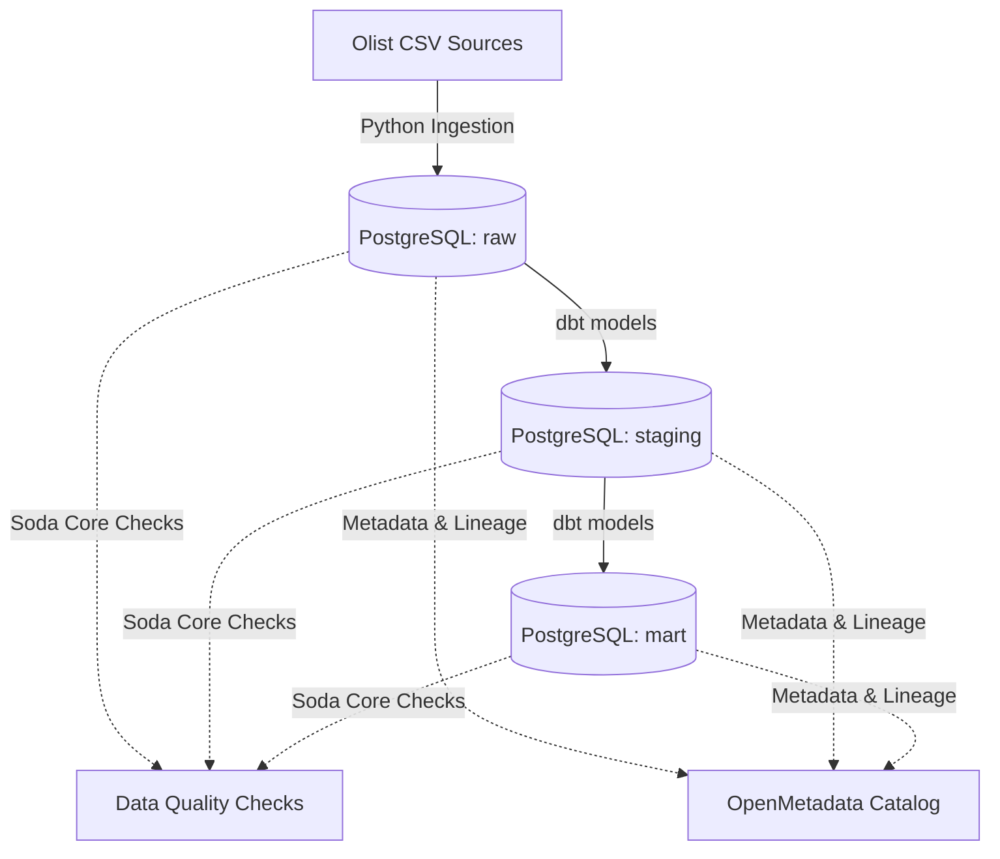

# Governed Commerce Lakehouse

A production-style, end-to-end Data Platform and Governance system for e-commerce analytics. This project ingests, transforms, tests, and governs retail data using the public **Olist E-Commerce dataset** from Brazil.

---

## 🏗️ Architecture & Component Overview

This repository integrates modern data stack tools to demonstrate ingestion, transformation, quality assurance, and governance:



*   **Data Sources**: Brazilian E-Commerce Public Dataset by Olist (containing customers, orders, payments, reviews, products, and sellers).
*   **Ingestion (`ingestion/`)**: A modular Python pipeline that pulls data from source hosts and loads them using SQLAlchemy into PostgreSQL under the `raw` schema.
*   **Data Warehouse & Modeling (`dbt_governed_commerce/`)**:
    *   **Staging Layer**: Cleaned, typed, and standardized views of the raw tables.
    *   **Mart Layer**: Optimized dimensional tables (`dim_customers`, `dim_products`, `dim_sellers`) and fact tables (`fct_orders`, `fct_payments`), alongside business-facing aggregate marts (`marts_customer_360`, `marts_delivery_performance`, `marts_revenue_daily`).
*   **Data Quality (`quality/`)**: Soda Core checks validating row counts, uniqueness, non-nullability, range constraints, and list validation.
*   **Data Governance (`openmetadata-docker/`)**: A local Docker-based deployment of OpenMetadata to handle metadata ingestion, data lineage, glossary definitions, and ownership catalogs.

---

## 📂 Project Directory Structure

```text
governed-commerece-lakehouse/
├── .env.example                  # Template for credentials
├── pyproject.toml                # Project dependencies (managed via uv/pip)
├── main.py                       # Project entrypoint skeleton
├── sql/
│   ├── 01_create_schemas.sql     # Database schema setup (raw, staging, mart, audit)
│   └── 02_create_raw_tables.sql  # Initial table structures for Olist ingestion
├── ingestion/
│   ├── download_olist.py         # Downloads raw Olist CSV datasets
│   ├── load_to_postgres.py       # Standardizes and loads raw CSVs to Postgres
│   └── run_ingestion.py          # Orchestrates downloading and loading pipelines
├── dbt_governed_commerce/        # dbt Project Directory
│   ├── dbt_project.yml           # dbt project configuration
│   ├── profiles.yml              # Database connection profile
│   └── models/
│       ├── sources.yml           # Declares raw schema sources
│       ├── staging/              # Stage 1: clean & cast staging models
│       └── marts/                # Stage 2: final facts, dimensions & aggregate marts
├── quality/
│   ├── configuration.yml         # Soda Core Postgres source configuration
│   └── checks/                   # Soda Core YAML assertion files (raw, staging, marts)
└── openmetadata-docker/          # OpenMetadata configuration & Compose environments
    └── docker-compose.yml        # Docker compose file to spin up OpenMetadata stack
```

---

## 🚀 Getting Started

### 1. Prerequisites
Ensure you have the following installed:
*   [Docker & Compose](https://docs.docker.com/get-docker/)
*   [uv](https://github.com/astral-sh/uv) (recommended) or Python 3.12+
*   An active PostgreSQL Database instance

### 2. Environment Configuration
Copy the `.env.example` file and supply your database credentials:
```bash
cp .env.example .env
```
Fill in the environment variables:
*   `POSTGRES_HOST`, `POSTGRES_PORT`, `POSTGRES_DB`, `POSTGRES_USER`, `POSTGRES_PASSWORD`, `POSTGRES_SSLMODE`

### 3. Initialize Database Schemas
Run the schema setup script inside your Postgres database:
```bash
psql -h <host> -U <user> -d <db> -f sql/01_create_schemas.sql
```
*Creates: `raw`, `staging`, `mart`, and `audit` schemas.*

### 4. Run Ingestion Pipeline
To download the raw Olist dataset files and load them into the `raw` schema in Postgres, execute:
```bash
uv run python ingestion/run_ingestion.py
```

### 5. Build and Test dbt Models
Navigate to the dbt project folder and run models:
```bash
cd dbt_governed_commerce
dbt deps
dbt run
dbt test
```
*This materializes the staging models as views in the `staging` schema and the business marts as tables in the `mart` schema.*

### 6. Run Data Quality Checks (Soda Core)
Ensure you are in the project root directory, then run the Soda scans:
```bash
# Verify connection
uv run soda test-connection -d postgres -c quality/configuration.yml

# Scan raw tables
uv run soda scan -d postgres -c quality/configuration.yml quality/checks/raw_checks.yml

# Scan staging tables
uv run soda scan -d postgres -c quality/configuration.yml quality/checks/staging_checks.yml

# Scan marts
uv run soda scan -d postgres -c quality/configuration.yml quality/checks/mart_checks.yml
```

### 7. Run Data Governance Catalog (OpenMetadata)
To spin up OpenMetadata locally to audit schema changes, lineage, and tag business terms:
```bash
cd openmetadata-docker
docker compose up -d
```
Visit the console at `http://localhost:8585` (Default credentials: `admin` / `admin`).

---

## 🧪 Data Quality Assertions
Data quality is strictly enforced through **Soda Core** tests. Examples of checks implemented:
*   **Completeness**: Checking for null values in primary keys (`order_id`, `customer_id`).
*   **Uniqueness**: Asserting zero duplicates in dimension keys.
*   **Validations**: Enforcing valid value lists (e.g., `order_status` values must belong to the approved set: `delivered`, `shipped`, `canceled`, etc.).
*   **Volume & Range**: Enforcing expected row counts and checking that monetary columns (`price`, `payment_value`) are non-negative.